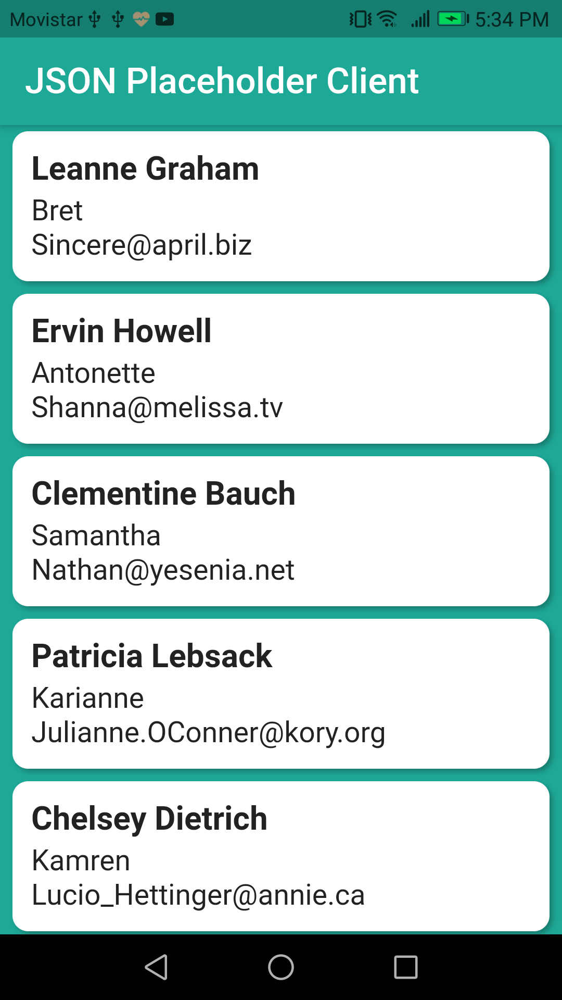
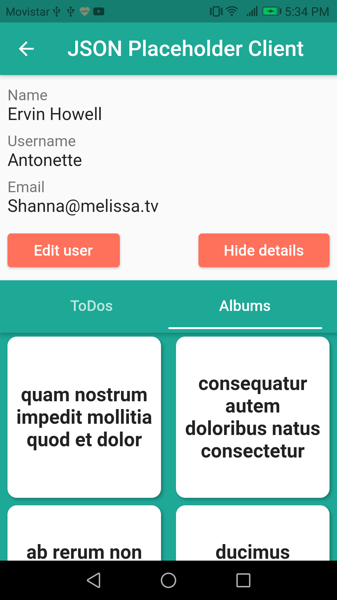
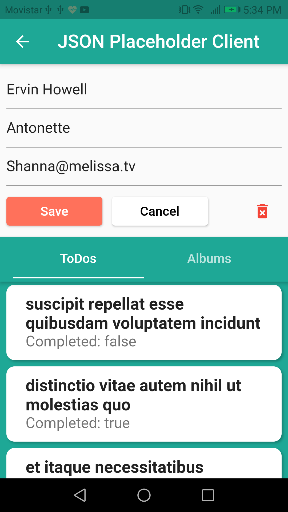
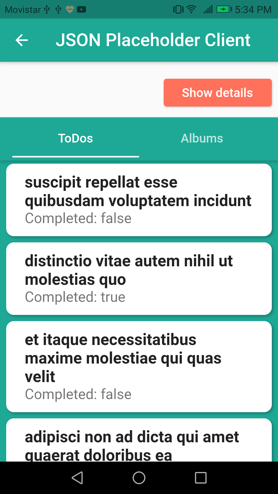

# JSON_Placeholder_Flutter_Client
A https://jsonplaceholder.typicode.com client built with Flutter / Un cliente de https://jsonplaceholder.typicode.com/ desarrollado con Flutter

## See the app in action / Mire la aplicación en funcionamiento

## Some features / Algunas características

- Consuming a Rest API
- HTTP Request (GET, PUT, DELETE)
- GET multiple data according to the user selected
- Use of JSON objects (Serialize and deserialize)
- Display data in list and grid way
- State management with Cubit (flutter_bloc package)
- A simple dependency injection with getIt package

## Some images / Algunas imágenes

|

|

|
|------------|-------------|
|

|

|